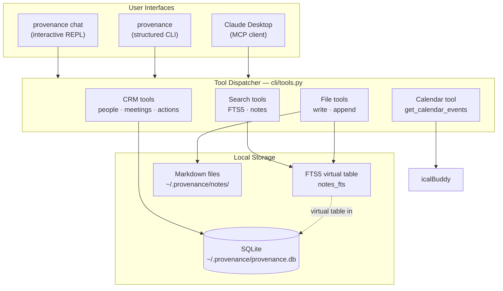

# Provenance

A local-first personal CRM and memory tool for professional use. Track people, meetings, notes, and action items. Surface context on demand through an AI-assisted REPL, a structured CLI, or directly from Claude Desktop via MCP.

Runs entirely on your machine. No accounts, no cloud sync.

---

## Install

```bash
uv tool install git+https://github.com/shawnzam/provenance
provenance init
```

Set up `~/.provenance/.env` with your OpenAI API key, then:

```bash
provenance doctor
provenance chat
```

**[Full documentation →](https://shawnzam.github.io/provenance/)**

---

## Quick reference

```bash
provenance chat                          # interactive REPL (primary interface)
provenance ask "who is Tom Sever?"       # natural language query
provenance people list
provenance meetings list --after 2026-03-01
provenance actions list --status open
provenance search "AI governance"

# Pipe to AI
provenance people tom-sever meetings --json \
  | provenance ai "write a short briefing before our next call"
```

---

## Requirements

| | |
|---|---|
| Python 3.11+ | Managed by `uv` |
| [`uv`](https://docs.astral.sh/uv/getting-started/installation/) | Package manager |
| OpenAI API key | For AI features |
| [`icalBuddy`](https://hasseg.org/icalBuddy/) | Optional — macOS calendar access |
| Claude Desktop | Optional — MCP integration |

---

## Architecture


