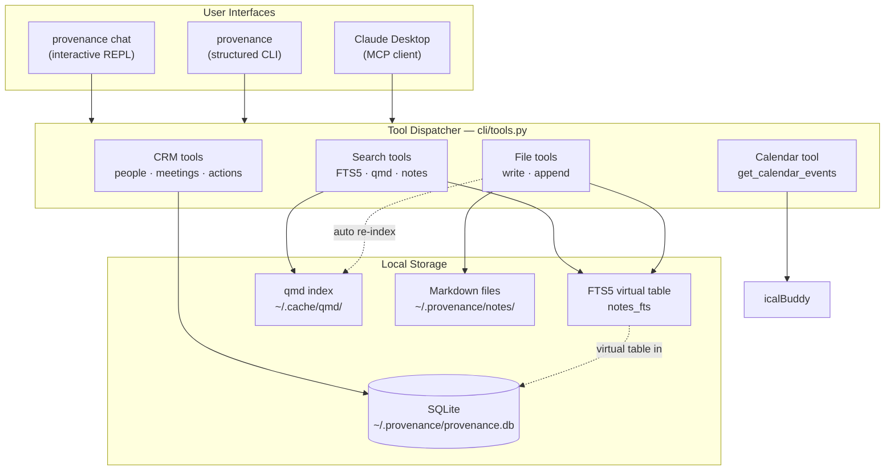

# Provenance

A local-first personal CRM and memory tool for professional use. Track people, meetings, notes, and action items. Surface context on demand through Claude Desktop, an interactive REPL, or a structured CLI.

Runs entirely on your machine. No accounts, no cloud sync.

---

## Install

```bash
uv tool install git+https://github.com/shawnzam/provenance
provenance init
```

Configure `~/.provenance/.env` (see [Setup](https://shawnzam.github.io/provenance/setup/)), then:

```bash
provenance doctor
```

**No OpenAI key needed** if you use Claude Desktop — see [Claude Desktop setup](https://shawnzam.github.io/provenance/mcp/).

**[Full documentation →](https://shawnzam.github.io/provenance/)**

---

## Claude Desktop quick start

**1. Install and initialize**

```bash
uv tool install git+https://github.com/shawnzam/provenance
provenance init
```

**2. Add to `~/Library/Application Support/Claude/claude_desktop_config.json`**

```json
{
  "mcpServers": {
    "provenance": {
      "command": "/Users/yourname/.local/bin/uv",
      "args": ["--directory", "/path/to/provenance", "run", "python", "mcp_server.py"]
    }
  }
}
```

Replace `/Users/yourname/.local/bin/uv` with `$(which uv)` and `/path/to/provenance` with the path to your clone.

**3. Restart Claude Desktop**

You'll see a hammer icon in the input bar confirming Provenance is connected. Then just ask:

```
What meetings do I have this week?
Prep me for my call with Alex
Add an action item to follow up with Sarah by Friday
Search my notes for anything about AI governance
```

No OpenAI key needed. Claude handles the AI — Provenance handles your data.

---

## Quick reference

```bash
provenance chat                          # interactive REPL (primary interface)
provenance ask "who is Alex Rivera?"     # natural language query
provenance people list
provenance meetings list --after 2026-03-01
provenance actions list --status open
provenance search "AI governance"

# Pipe to AI
provenance people alex-rivera meetings --json \
  | provenance ai "write a short briefing before our next call"
```

Notes, meeting files, and documents support `[[slug]]` wiki-links. When Claude reads a note, it follows links and embeds the referenced content inline — up to 2 hops. Supported targets: meetings, documents, freeform notes, and people.

```markdown
<!-- In any .md file -->
See [[alex-rivera]] for background and [[ai-governance-framework]] for the full doc.
```

---

## Requirements

| | |
|---|---|
| Python 3.11+ | Managed by `uv` |
| [`uv`](https://docs.astral.sh/uv/getting-started/installation/) | Package manager |
| [Claude Desktop](https://claude.ai/download) | Optional — use as your AI interface (no OpenAI key needed) |
| OpenAI API key | Optional — only for the standalone REPL and `ask`/`ai` commands |
| [`icalBuddy`](https://hasseg.org/icalBuddy/) | Optional — macOS calendar access |
| [qmd](https://github.com/tobi/qmd) | Optional — hybrid AI-powered notes search (vector + BM25 + LLM reranking) |

---

## Architecture


